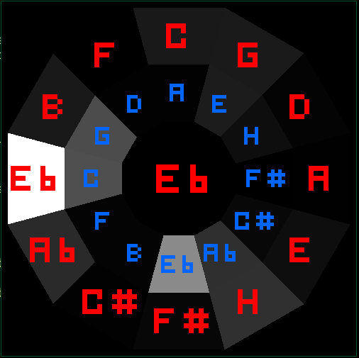

# info

Krug is simple program that tries to recognise chords (only major and minor for now).
You can see how much of each chord it recognised by brightness on circle of fifths and the strongest chord in the middle.
red is for major chords and blue for minor
It isn't very accurate.  



# build

```sh
mkdir build
make release
```

run with ./exe

## dependencies

make  
SDL2

### included:

[fft](https://www.kurims.kyoto-u.ac.jp/~ooura/fft.html)

# config

configuration is made through simple config.txt file (just change the numbers)  
the file is only read at start

# how to capture audio from system (not microphone)

idk for windows but in linux I use pavucontrol and select "monitor of something" in input devices
(you need to select all input devices to see it)
You also might have to run `sudo modprobe snd-aloop` or something to enable loopback device

# WINDOWS

## compile

If you dont have SDL2 set up you can download dll at [SDL2 github](https://github.com/libsdl-org/SDL)
under releases->SDL2-something-win32-something.zip and place SDL2.dll in this directory  
then download header files from the same releases page (they are in SDL2-devel-something-your_compiler.zip)
and put them in include/SDL2  
and finally, compile with

```
gcc -o krug src/* -Iinclude -lSDL2 -L. -mwindows
```
